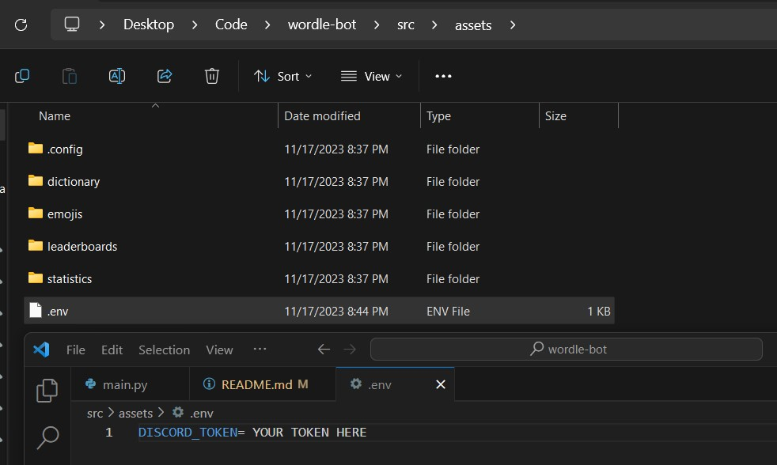
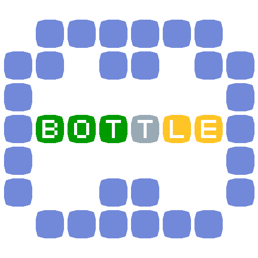

# BOTTLE

A Discord Wordle bot.

Created by EggieVAL, CasterNinja, LucaVits, SoumayahIlias, timcuber37, and 7ds3f.

## Requirements
This bot requires Python, PyEnchant and Discord to function properly.
- To install Python 3.11.6, visit [this link](https://www.python.org/downloads/)
- To install PyEnchant, use `pip install pyenchant` in a terminal
- To install Discord, use `pip install discord` in a terminal

## How To Run Bottle
1. Download the repo code
2. Install the required libraries mentioned above
3. Get a Discord bot token using this [Web Tutorial](https://discordgsm.com/guide/how-to-get-a-discord-bot-token). Save The token and **DO NOT SHARE YOUR TOKEN WITH ANYONE**
4. Create a `.env` file in "...\wordle-bot\src\assets\". Paste "DISCORD_TOKEN=*PASTE BOT TOKEN HERE*" in that file. **AGAIN, DO NOT SHARE THIS WITH ANYONE** 
Below is an example image of how you should setup your `.env` file:

6. Add the bot to your server, Tutorial [Linked Here](https://discordjs.guide/preparations/adding-your-bot-to-servers.html#creating-and-using-your-invite-link)
7. Locate and run the code: Find "...\wordle-bot\src\main.py". In a terminal, run the command `python /path/to/your/directory/main.py`.
The code should output "Bottle is Running!" and the bot should be online in the server, to stop running the bot kill the terminal.

8. To get started with BOTTLE, use the `/help` command in Discord to get started

